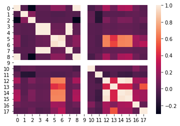
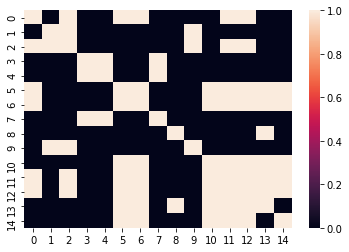
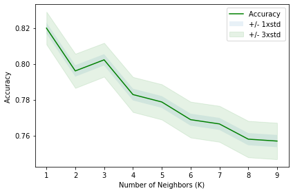
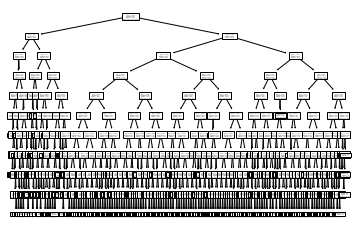

# Data Preparation


```python
import numpy as np
import matplotlib.pyplot as plt
import pandas as pd
import numpy as np
from sklearn import preprocessing
%matplotlib inline
import seaborn
from sklearn.model_selection import train_test_split
```


```python
df = pd.read_csv('./star_classification.csv')
df.head(5)
```


<div>
<style scoped>
    .dataframe tbody tr th:only-of-type {
        vertical-align: middle;
    }

    .dataframe tbody tr th {
        vertical-align: top;
    }

    .dataframe thead th {
        text-align: right;
    }
</style>
<table border="1" class="dataframe">
  <thead>
    <tr style="text-align: right;">
      <th></th>
      <th>obj_ID</th>
      <th>alpha</th>
      <th>delta</th>
      <th>u</th>
      <th>g</th>
      <th>r</th>
      <th>i</th>
      <th>z</th>
      <th>run_ID</th>
      <th>rerun_ID</th>
      <th>cam_col</th>
      <th>field_ID</th>
      <th>spec_obj_ID</th>
      <th>class</th>
      <th>redshift</th>
      <th>plate</th>
      <th>MJD</th>
      <th>fiber_ID</th>
    </tr>
  </thead>
  <tbody>
    <tr>
      <th>0</th>
      <td>1.237661e+18</td>
      <td>135.689107</td>
      <td>32.494632</td>
      <td>23.87882</td>
      <td>22.27530</td>
      <td>20.39501</td>
      <td>19.16573</td>
      <td>18.79371</td>
      <td>3606</td>
      <td>301</td>
      <td>2</td>
      <td>79</td>
      <td>6.543777e+18</td>
      <td>GALAXY</td>
      <td>0.634794</td>
      <td>5812</td>
      <td>56354</td>
      <td>171</td>
    </tr>
    <tr>
      <th>1</th>
      <td>1.237665e+18</td>
      <td>144.826101</td>
      <td>31.274185</td>
      <td>24.77759</td>
      <td>22.83188</td>
      <td>22.58444</td>
      <td>21.16812</td>
      <td>21.61427</td>
      <td>4518</td>
      <td>301</td>
      <td>5</td>
      <td>119</td>
      <td>1.176014e+19</td>
      <td>GALAXY</td>
      <td>0.779136</td>
      <td>10445</td>
      <td>58158</td>
      <td>427</td>
    </tr>
    <tr>
      <th>2</th>
      <td>1.237661e+18</td>
      <td>142.188790</td>
      <td>35.582444</td>
      <td>25.26307</td>
      <td>22.66389</td>
      <td>20.60976</td>
      <td>19.34857</td>
      <td>18.94827</td>
      <td>3606</td>
      <td>301</td>
      <td>2</td>
      <td>120</td>
      <td>5.152200e+18</td>
      <td>GALAXY</td>
      <td>0.644195</td>
      <td>4576</td>
      <td>55592</td>
      <td>299</td>
    </tr>
    <tr>
      <th>3</th>
      <td>1.237663e+18</td>
      <td>338.741038</td>
      <td>-0.402828</td>
      <td>22.13682</td>
      <td>23.77656</td>
      <td>21.61162</td>
      <td>20.50454</td>
      <td>19.25010</td>
      <td>4192</td>
      <td>301</td>
      <td>3</td>
      <td>214</td>
      <td>1.030107e+19</td>
      <td>GALAXY</td>
      <td>0.932346</td>
      <td>9149</td>
      <td>58039</td>
      <td>775</td>
    </tr>
    <tr>
      <th>4</th>
      <td>1.237680e+18</td>
      <td>345.282593</td>
      <td>21.183866</td>
      <td>19.43718</td>
      <td>17.58028</td>
      <td>16.49747</td>
      <td>15.97711</td>
      <td>15.54461</td>
      <td>8102</td>
      <td>301</td>
      <td>3</td>
      <td>137</td>
      <td>6.891865e+18</td>
      <td>GALAXY</td>
      <td>0.116123</td>
      <td>6121</td>
      <td>56187</td>
      <td>842</td>
    </tr>
  </tbody>
</table>
</div>


```python
df['class'].value_counts()
```


    GALAXY    59445
    STAR      21594
    QSO       18961
    Name: class, dtype: int64


```python
df['class'].replace('GALAXY',0,inplace=True)
df['class'].replace('STAR',1,inplace=True)
df['class'].replace('QSO',2,inplace=True)
df.head()
```


<div>
<style scoped>
    .dataframe tbody tr th:only-of-type {
        vertical-align: middle;
    }

    .dataframe tbody tr th {
        vertical-align: top;
    }

    .dataframe thead th {
        text-align: right;
    }
</style>
<table border="1" class="dataframe">
  <thead>
    <tr style="text-align: right;">
      <th></th>
      <th>obj_ID</th>
      <th>alpha</th>
      <th>delta</th>
      <th>u</th>
      <th>g</th>
      <th>r</th>
      <th>i</th>
      <th>z</th>
      <th>run_ID</th>
      <th>rerun_ID</th>
      <th>cam_col</th>
      <th>field_ID</th>
      <th>spec_obj_ID</th>
      <th>class</th>
      <th>redshift</th>
      <th>plate</th>
      <th>MJD</th>
      <th>fiber_ID</th>
    </tr>
  </thead>
  <tbody>
    <tr>
      <th>0</th>
      <td>1.237661e+18</td>
      <td>135.689107</td>
      <td>32.494632</td>
      <td>23.87882</td>
      <td>22.27530</td>
      <td>20.39501</td>
      <td>19.16573</td>
      <td>18.79371</td>
      <td>3606</td>
      <td>301</td>
      <td>2</td>
      <td>79</td>
      <td>6.543777e+18</td>
      <td>0</td>
      <td>0.634794</td>
      <td>5812</td>
      <td>56354</td>
      <td>171</td>
    </tr>
    <tr>
      <th>1</th>
      <td>1.237665e+18</td>
      <td>144.826101</td>
      <td>31.274185</td>
      <td>24.77759</td>
      <td>22.83188</td>
      <td>22.58444</td>
      <td>21.16812</td>
      <td>21.61427</td>
      <td>4518</td>
      <td>301</td>
      <td>5</td>
      <td>119</td>
      <td>1.176014e+19</td>
      <td>0</td>
      <td>0.779136</td>
      <td>10445</td>
      <td>58158</td>
      <td>427</td>
    </tr>
    <tr>
      <th>2</th>
      <td>1.237661e+18</td>
      <td>142.188790</td>
      <td>35.582444</td>
      <td>25.26307</td>
      <td>22.66389</td>
      <td>20.60976</td>
      <td>19.34857</td>
      <td>18.94827</td>
      <td>3606</td>
      <td>301</td>
      <td>2</td>
      <td>120</td>
      <td>5.152200e+18</td>
      <td>0</td>
      <td>0.644195</td>
      <td>4576</td>
      <td>55592</td>
      <td>299</td>
    </tr>
    <tr>
      <th>3</th>
      <td>1.237663e+18</td>
      <td>338.741038</td>
      <td>-0.402828</td>
      <td>22.13682</td>
      <td>23.77656</td>
      <td>21.61162</td>
      <td>20.50454</td>
      <td>19.25010</td>
      <td>4192</td>
      <td>301</td>
      <td>3</td>
      <td>214</td>
      <td>1.030107e+19</td>
      <td>0</td>
      <td>0.932346</td>
      <td>9149</td>
      <td>58039</td>
      <td>775</td>
    </tr>
    <tr>
      <th>4</th>
      <td>1.237680e+18</td>
      <td>345.282593</td>
      <td>21.183866</td>
      <td>19.43718</td>
      <td>17.58028</td>
      <td>16.49747</td>
      <td>15.97711</td>
      <td>15.54461</td>
      <td>8102</td>
      <td>301</td>
      <td>3</td>
      <td>137</td>
      <td>6.891865e+18</td>
      <td>0</td>
      <td>0.116123</td>
      <td>6121</td>
      <td>56187</td>
      <td>842</td>
    </tr>
  </tbody>
</table>
</div>


```python
df.columns
```


    Index(['obj_ID', 'alpha', 'delta', 'u', 'g', 'r', 'i', 'z', 'run_ID',
           'rerun_ID', 'cam_col', 'field_ID', 'spec_obj_ID', 'class', 'redshift',
           'plate', 'MJD', 'fiber_ID'],
          dtype='object')


```python
X = df[['obj_ID', 'alpha', 'delta', 'u', 'g', 'r', 'i', 'z', 'run_ID',
       'rerun_ID', 'cam_col', 'field_ID', 'spec_obj_ID', 'redshift',
       'plate', 'MJD', 'fiber_ID']].values  #.astype(float)
y = df['class'].values
X.shape
```


    (100000, 17)


# Feature Selection


```python
corr=np.corrcoef(X,y,rowvar=False)
seaborn.heatmap(corr)
```

    C:\ProgramData\Anaconda3\lib\site-packages\numpy\lib\function_base.py:2642: RuntimeWarning: invalid value encountered in true_divide
      c /= stddev[:, None]
    C:\ProgramData\Anaconda3\lib\site-packages\numpy\lib\function_base.py:2643: RuntimeWarning: invalid value encountered in true_divide
      c /= stddev[None, :]
    


    <AxesSubplot:>


    

    


Column number 9 in correlation matrix is null. columns 0 & 8 as well as well 12 & 14 are exactly the same, meaning they are solid ration of one another. Thus, we will eliminate columns 9,8,12


```python
X = df[['obj_ID', 'alpha', 'delta', 'u', 'g', 'r', 'i', 'z',
       'cam_col', 'field_ID', 'redshift',
       'plate', 'MJD', 'fiber_ID']].values  #.astype(float)
X.shape
```


    (100000, 14)


```python
corr=np.corrcoef(X,y,rowvar=False)
seaborn.heatmap(abs(corr)>0.1)
```


    <AxesSubplot:>


    

    


```python
X = df[['r', 'i', 'redshift', 'plate', 'MJD',]]
X.shape
```


    (100000, 5)


```python
X_train_cv,X_test,y_train_cv,y_test=train_test_split(X,y,test_size=0.2,random_state=4)
X_train,X_cv,y_train,y_cv=train_test_split(X_train_cv,y_train_cv,test_size=0.2,random_state=4)
```

# K Nearest Neighbors


```python
from sklearn.neighbors import KNeighborsClassifier
from sklearn import metrics

k = 5
#Train Model and Predict  
neigh = KNeighborsClassifier(n_neighbors = k).fit(X_train,y_train)
neigh
```


    KNeighborsClassifier()


```python
yhat = neigh.predict(X_cv)
yhat[0:5]
print("Train set Accuracy: ", metrics.accuracy_score(y_train, neigh.predict(X_train)))
print("Cross Validation set Accuracy: ", metrics.accuracy_score(y_cv, yhat))
```

    Train set Accuracy:  0.837453125
    Cross Validation set Accuracy:  0.77875
    

#### find the best k value using cross validation set.


```python
Ks = 10
mean_acc = np.zeros((Ks-1))
std_acc = np.zeros((Ks-1))

for n in range(1,Ks):
    
    #Train Model and Predict  
    neigh = KNeighborsClassifier(n_neighbors = n).fit(X_train,y_train)
    yhat=neigh.predict(X_cv)
    mean_acc[n-1] = metrics.accuracy_score(y_cv, yhat)

    
    std_acc[n-1]=np.std(yhat==y_cv)/np.sqrt(yhat.shape[0])

mean_acc
```


    array([0.8199375, 0.7960625, 0.80225  , 0.782875 , 0.77875  , 0.768875 ,
           0.7665   , 0.758    , 0.7569375])


```python
plt.plot(range(1,Ks),mean_acc,'g')
plt.fill_between(range(1,Ks),mean_acc - 1 * std_acc,mean_acc + 1 * std_acc, alpha=0.10)
plt.fill_between(range(1,Ks),mean_acc - 3 * std_acc,mean_acc + 3 * std_acc, alpha=0.10,color="green")
plt.legend(('Accuracy ', '+/- 1xstd','+/- 3xstd'))
plt.ylabel('Accuracy ')
plt.xlabel('Number of Neighbors (K)')
plt.tight_layout()
plt.show()
```


    

    


```python
from sklearn.neighbors import KNeighborsClassifier
k = 1
#Train Model and Predict  
neigh = KNeighborsClassifier(n_neighbors = k).fit(X_train,y_train)
neigh
```


    KNeighborsClassifier(n_neighbors=1)


```python
yhat = neigh.predict(X_test)
yhat[0:5]
from sklearn import metrics
print("Train set Accuracy: ", metrics.accuracy_score(y_train, neigh.predict(X_train)))
print("Test set Accuracy: ", metrics.accuracy_score(y_test, yhat))
```

    Train set Accuracy:  1.0
    Test set Accuracy:  0.8209
    

# Decision Trees


```python
from sklearn.tree import DecisionTreeClassifier
from sklearn import tree
from sklearn import metrics
import matplotlib.pyplot as plt


starTree = DecisionTreeClassifier(criterion="entropy", max_depth = 4)
starTree # it shows the default parameters
```


    DecisionTreeClassifier(criterion='entropy', max_depth=4)


```python
starTree.fit(X_train,y_train)
predTree = starTree.predict(X_cv)
print("DecisionTrees's Accuracy: ", metrics.accuracy_score(y_cv, predTree))
```

    DecisionTrees's Accuracy:  0.9574375
    

### find the best max_depth using cross validation set.


```python
ds=10
for i in range(1,ds):
    starTree = DecisionTreeClassifier(criterion="entropy", max_depth = i)
    starTree.fit(X_train,y_train)
    predTree = starTree.predict(X_cv)
    print("DecisionTrees's Accuracy on CV set: ", metrics.accuracy_score(y_cv, predTree))
```

    DecisionTrees's Accuracy:  0.8094375
    DecisionTrees's Accuracy:  0.949
    DecisionTrees's Accuracy:  0.9525625
    DecisionTrees's Accuracy:  0.9574375
    DecisionTrees's Accuracy:  0.9615625
    DecisionTrees's Accuracy:  0.9641875
    DecisionTrees's Accuracy:  0.9681875
    DecisionTrees's Accuracy:  0.9689375
    DecisionTrees's Accuracy:  0.9715
    


```python
starTree = DecisionTreeClassifier(criterion="entropy", max_depth = 10)
starTree.fit(X_train,y_train)
predTree = starTree.predict(X_test)
print("DecisionTrees's Accuracy on test set: ", metrics.accuracy_score(y_test, predTree))
```

    DecisionTrees's Accuracy on test set:  0.969
    


```python
tree.plot_tree(starTree)
plt.show()
```


    

    


# Regression


```python
from sklearn.linear_model import LogisticRegression
from sklearn.metrics import confusion_matrix
LR = LogisticRegression(solver="newton-cg",fit_intercept=True,C=0.1,max_iter=100).fit(X_train,y_train)
LR
```

    C:\ProgramData\Anaconda3\lib\site-packages\scipy\optimize\linesearch.py:478: LineSearchWarning: The line search algorithm did not converge
      warn('The line search algorithm did not converge', LineSearchWarning)
    C:\ProgramData\Anaconda3\lib\site-packages\scipy\optimize\linesearch.py:327: LineSearchWarning: The line search algorithm did not converge
      warn('The line search algorithm did not converge', LineSearchWarning)
    C:\ProgramData\Anaconda3\lib\site-packages\sklearn\utils\optimize.py:202: ConvergenceWarning: newton-cg failed to converge. Increase the number of iterations.
      warnings.warn("newton-cg failed to converge. Increase the "
    


    LogisticRegression(C=0.1, solver='newton-cg')


```python
yhat = LR.predict(X_test)
yhat
```


    array([0, 0, 0, ..., 0, 2, 0], dtype=int64)


```python
yhat_prob = LR.predict_proba(X_cv)
yh=np.argmax(yhat_prob,axis=1)
print("Regression's Accuracy: ", metrics.accuracy_score(y_cv, yh))
```

    Regression's Accuracy:  0.924625
    
